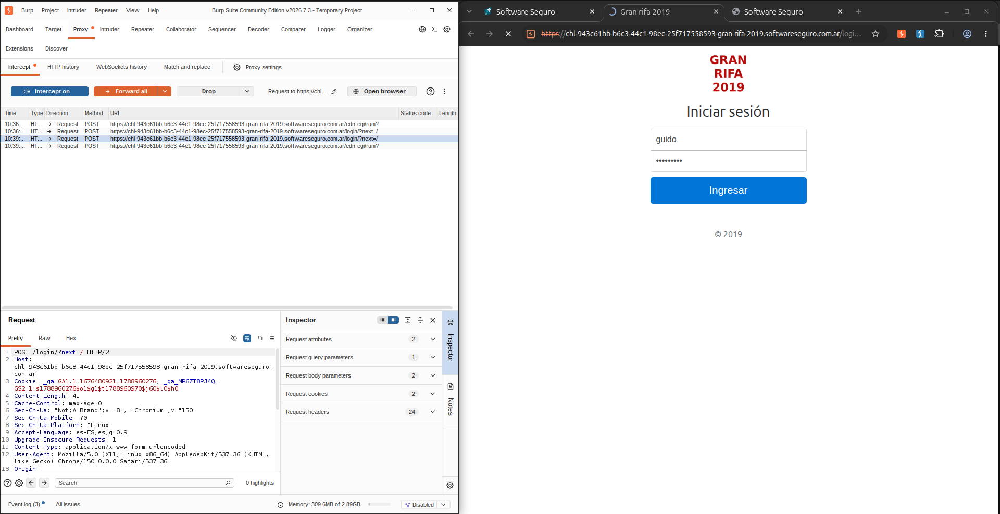

# Que es proxy?

Un **proxy es un servidor intermediario** que se encuentra entre el cliente y el servidor al que se quiere acceder. Cuando un usuario realiza una solicitud, esta pasa primero por el proxy, que puede recibirla, analizarla y posteriormente enviarla al servidor de destino.

# Diferencia con una VPN?
La principal diferencia es que un **proxy actúa como intermediario entre el dispositivo y el servidor para determinadas comunicaciones**, pudiendo utilizarse para gestionar, analizar e incluso modificar las peticiones que se realizan. En cambio, una **VPN** establece una conexión entre el dispositivo y un servidor VPN mediante un **túnel cifrado**, haciendo que el tráfico de red del dispositivo pase por dicho servidor y proporcionando mayor protección y privacidad en la comunicación.
