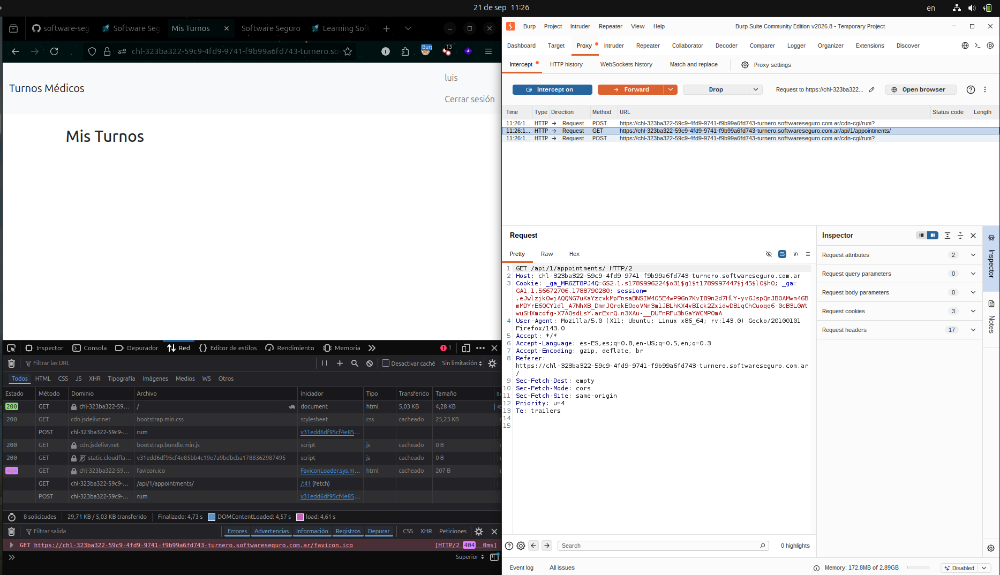

Se configuró Burp Suite como proxy local y se instaló su certificado CA en el navegador. Se logró interceptar y detener exitosamente en vuelo la solicitud hacia la aplicación del laboratorio.

# Endpoints

## | Peticion | Endpoint |

**GET** /api/1/appointments/ \

Esta peticion enviada por la pagina para consultar la lista de turnos programados por el usuario. Tambien fue la peticion que decidi detener en el vuelo antes de que llegue al servidor.

### Peticion detenida en el vuelo
GET /api/1/appointments/ HTTP/2\
Host: chl-323ba322-59c9-4fd9-9741-f9b99a6fd743-turnero.softwareseguro.com.ar\
User-Agent: Mozilla/5.0 (X11; Ubuntu; Linux x86_64; rv:143.0) Gecko/20100101 Firefox/143.0

**POST** /cdn-cgi/rum?

Esta peticion son las metricas de rendimiento del proveedor Cloudflare para Real User Monitoriong.