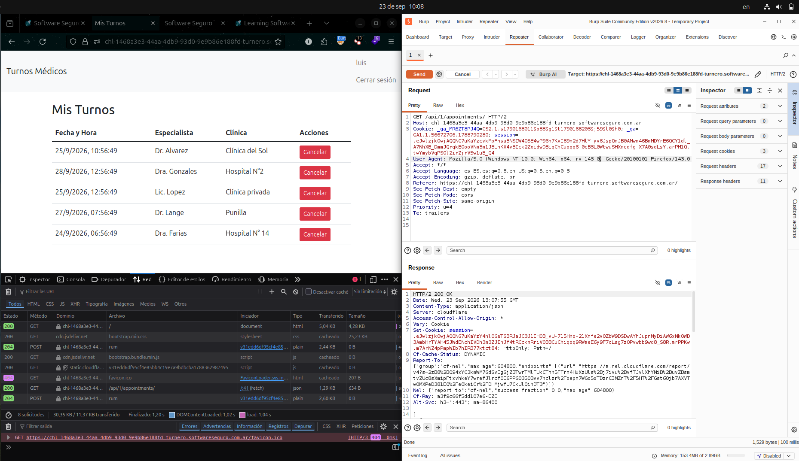

# Manipulacion Manual de Peticiones

## Modificacion Realizada

Modifique el header de User-Agent de la peticion /api/1/appointments/. Siendo el USer-Agent original el siguiente.

**Mozilla/5.0 (X11; Ubuntu; Linux x86_64; rv:143.0) Gecko/20100101 Firefox/143.0**

Luego lo modifique para simular que la peticion provenia de Firefox en Windows

**Mozilla/5.0 (Windows NT 10.0; Win64; x64; rv:143.0) Gecko/20100101 Firefox/143.0**

## Resultado 
 
 Despues de modificar la peticion, se envio. El servidor respondio correctamente a la solicitud, sin rechazarla debido al USer-Agent modificado.